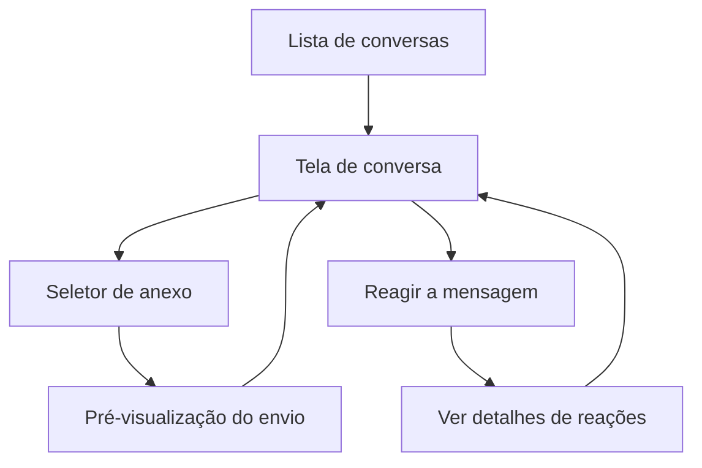

## 1. Product Overview
Adicionar ao chat o envio de mídias e reações (incluindo remover reação), mantendo a experiência e os fluxos iguais ao WhatsApp Business.
Foco em paridade visual e comportamental no uso diário (desktop-first).

## 2. Core Features

### 2.1 User Roles
| Papel | Método de cadastro | Permissões principais |
|------|---------------------|------------------------|
| Usuário | Fora do escopo deste documento | Enviar mensagens, anexar mídias, reagir e remover reações |

### 2.2 Feature Module
1. **Lista de conversas**: lista de chats, busca, estado vazio.
2. **Tela de conversa**: timeline de mensagens, envio de mídia (imagem, sticker, gif, áudio, vídeo, PTV, documento, link), reações (adicionar/visualizar/remover).

### 2.3 Page Details
| Page Name | Module Name | Feature description |
|-----------|-------------|---------------------|
| Lista de conversas | Lista e seleção | Exibir lista de chats; abrir uma conversa ao clicar; manter seleção e indicador de não lidas (se existir no produto). |
| Lista de conversas | Estado vazio (painel direito) | Exibir placeholder no painel de conversa quando nenhum chat estiver selecionado, seguindo padrão WhatsApp Business. |
| Tela de conversa | Cabeçalho do chat | Exibir nome/identificador do contato/empresa e ações (ex.: menu); manter padrão visual existente do produto. |
| Tela de conversa | Lista de mensagens (renderização) | Renderizar mensagens por tipo: texto; imagem; sticker; GIF; áudio; vídeo; PTV (vídeo mensagem); documento; link com preview. Garantir alinhamento (enviada/recebida), horários e estados (enviando/enviado/falhou). |
| Tela de conversa | Seletor de anexo | Abrir menu de anexos (ícones/itens) com opções: Imagem/Vídeo, Sticker, GIF, Áudio, PTV, Documento, Link. Permitir fechar sem ação. |
| Tela de conversa | Pré-visualização do envio | Antes de enviar, exibir preview (thumbnail/player/ícone), permitir adicionar legenda quando aplicável, confirmar envio ou cancelar. |
| Tela de conversa | Upload e envio | Fazer upload quando necessário (com progresso/estado), criar mensagem no chat, manter comportamento de bloqueio mínimo (permitir continuar navegando no chat). |
| Tela de conversa | Players e visualizadores inline | Permitir: ampliar imagem; reproduzir vídeo; reproduzir áudio (play/pause, duração/seek quando aplicável); abrir documento; abrir link. |
| Tela de conversa | Link preview | Ao enviar link, gerar/exibir preview (título, domínio e thumbnail quando disponível); permitir enviar apenas como link simples caso preview não carregue. |
| Tela de conversa | Reações (adicionar) | Permitir reagir a uma mensagem via gesto equivalente ao WhatsApp Business (ex.: hover/long-press/contexto): mostrar “barra rápida” de emojis + opção de “+” para mais; salvar e exibir reação no rodapé da bolha. |
| Tela de conversa | Reações (visualizar) | Exibir contagem e emojis reagidos; ao clicar, abrir painel/modal/lista com quem reagiu e quais emojis (padrão WhatsApp Business). |
| Tela de conversa | Reações (remover) | Permitir remover a própria reação tocando/clicando novamente no mesmo emoji (na mensagem ou na lista de reações) e atualizar UI imediatamente. |

## 3. Core Process
Fluxo de envio de mídia (Usuário): você abre uma conversa, clica no ícone de anexo, escolhe o tipo (ex.: imagem), revisa a pré-visualização (opcionalmente adiciona legenda), confirma o envio; o app faz upload (se aplicável), publica a mensagem, e a timeline atualiza com o estado correto.

Fluxo de reações (Usuário): você posiciona o cursor/aciona o menu na mensagem, escolhe um emoji na barra rápida (ou abre “+” para mais), a reação aparece na mensagem com contagem; para remover, você clica no mesmo emoji novamente (na mensagem ou no detalhe de reações) e a reação é removida.

