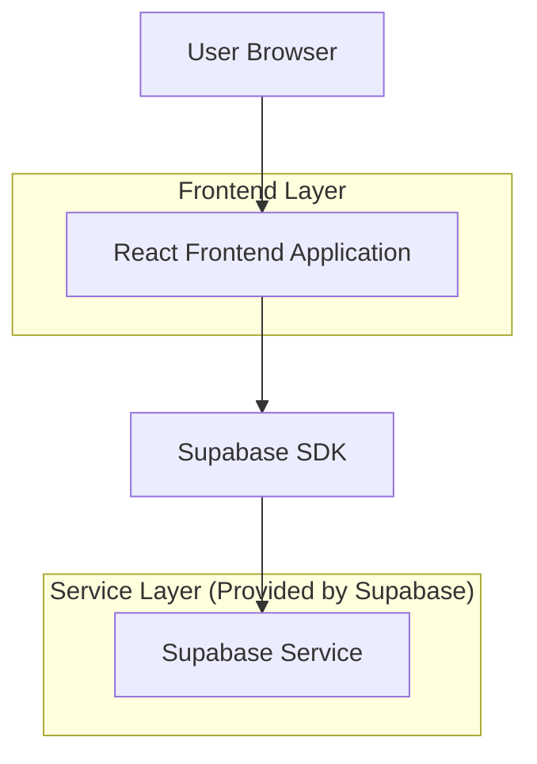
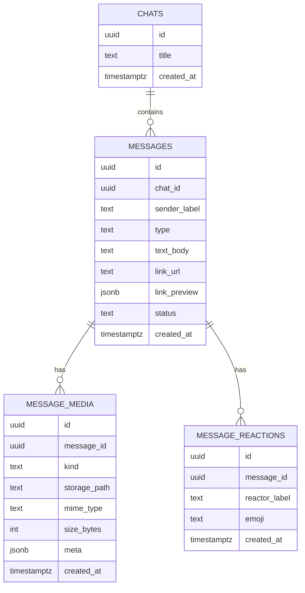

## 1.Architecture design


## 2.Technology Description
- Frontend: React@18 + TypeScript + vite + tailwindcss@3
- Backend: Supabase (PostgreSQL + Storage + Realtime)

## 3.Route definitions
| Route | Purpose |
|-------|---------|
| / | Lista de conversas + estado vazio do painel de conversa |
| /chat/:chatId | Abrir conversa e habilitar envio de mídia e reações |

## 6.Data model(if applicable)

### 6.1 Data model definition


### 6.2 Data Definition Language
Chats (chats)
```sql
CREATE TABLE chats (
  id UUID PRIMARY KEY DEFAULT gen_random_uuid(),
  title TEXT,
  created_at TIMESTAMPTZ NOT NULL DEFAULT now()
);

CREATE TABLE messages (
  id UUID PRIMARY KEY DEFAULT gen_random_uuid(),
  chat_id UUID NOT NULL,
  sender_label TEXT NOT NULL,
  type TEXT NOT NULL CHECK (type IN ('text','image','sticker','gif','audio','video','ptv','document','link')),
  text_body TEXT,
  link_url TEXT,
  link_preview JSONB,
  status TEXT NOT NULL DEFAULT 'sent' CHECK (status IN ('sending','sent','failed')),
  created_at TIMESTAMPTZ NOT NULL DEFAULT now()
);
CREATE INDEX idx_messages_chat_id_created_at ON messages(chat_id, created_at DESC);

CREATE TABLE message_media (
  id UUID PRIMARY KEY DEFAULT gen_random_uuid(),
  message_id UUID NOT NULL,
  kind TEXT NOT NULL CHECK (kind IN ('image','sticker','gif','audio','video','ptv','document')),
  storage_path TEXT NOT NULL,
  mime_type TEXT,
  size_bytes INT,
  meta JSONB,
  created_at TIMESTAMPTZ NOT NULL DEFAULT now()
);
CREATE INDEX idx_message_media_message_id ON message_media(message_id);

CREATE TABLE message_reactions (
  id UUID PRIMARY KEY DEFAULT gen_random_uuid(),
  message_id UUID NOT NULL,
  reactor_label TEXT NOT NULL,
  emoji TEXT NOT NULL,
  created_at TIMESTAMPTZ NOT NULL DEFAULT now()
);
CREATE UNIQUE INDEX uq_reaction_one_per_user_per_emoji ON message_reactions(message_id, reactor_label, emoji);
CREATE INDEX idx_message_reactions_message_id ON message_reactions(message_id);

-- Permissões (ajuste conforme seu setup de RLS/roles)
GRANT SELECT ON chats, messages, message_media, message_reactions TO anon;
GRANT ALL PRIVILEGES ON chats, messages, message_media, message_reactions TO authenticated;
```

Storage (Supabase)
- Bucket: `chat-media`
- Convenção de paths: `chats/{chatId}/messages/{messageId}/{filename}`
- Para UI estilo WhatsApp Business, usar URLs assinadas (quando necessário) e cache local no cliente.
