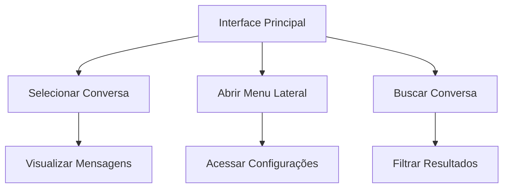

## 1. Product Overview
Aplicação web que replica fielmente a interface do WhatsApp Web, proporcionando uma experiência visual idêntica ao aplicativo original. Permite visualizar conversas, mensagens e interagir com uma interface familiar e intuitiva.

## 2. Core Features

### 2.1 User Roles
| Role | Registration Method | Core Permissions |
|------|---------------------|------------------|
| User | Demo access | Visualizar conversas e mensagens, interagir com interface |

### 2.2 Feature Module
Nossa replicação do WhatsApp Web consiste nos seguintes elementos principais:
1. **Interface Principal**: lista de conversas, painel de mensagens, menu lateral retrátil
2. **Elementos de Navegação**: barra de pesquisa, botões de ação, configurações

### 2.3 Page Details
| Page Name | Module Name | Feature description |
|-----------|-------------|---------------------|
| Interface Principal | Lista de Conversas | Exibir avatares, nomes, preview de mensagens, horários e indicadores de mensagens não lidas |
| Interface Principal | Painel de Conversa | Mostrar cabeçalho do contato, área de mensagens, input de texto com botões de envio e anexo |
| Interface Principal | Menu Lateral | Implementar menu retrátil com opções de navegação e configurações |
| Interface Principal | Barra de Pesquisa | Permitir busca de conversas e contatos com filtro em tempo real |
| Interface Principal | Botões de Ação | Incluir novo chat, menu de configurações com ícones originais |

## 3. Core Process
O usuário acessa a aplicação e visualiza imediatamente a interface principal com a lista de conversas à esquerda. Ao clicar em uma conversa, o painel direito exibe os detalhes e mensagens. O menu lateral pode ser aberto/fechado através de um botão hambúrguer. A barra de pesquisa permite filtrar conversas em tempo real.

## 4. User Interface Design

### 4.1 Design Style
- **Cores Primárias**: Verde #128C7E, branco, cinza
- **Tipografia**: Fonte original do WhatsApp (Helvetica Neue, Segoe UI)
- **Estilo de Botões**: Arredondados com ícones minimalistas
- **Layout**: Baseado em cards com sombras sutis
- **Ícones**: Estilo outline com espessura consistente
- **Animações**: Transições suaves de 200-300ms para interações

### 4.2 Page Design Overview
| Page Name | Module Name | UI Elements |
|-----------|-------------|-------------|
| Interface Principal | Lista de Conversas | Cards com avatar circular (40px), nome em negrito, preview em cinza, horário à direita, badge de notificações vermelho |
| Interface Principal | Painel de Conversa | Header com avatar (40px), nome e status, área de mensagens com fundo degradê, input com borda arredondada e botões de ação |
| Interface Principal | Menu Lateral | Drawer com fundo branco, ícones em verde, opções com hover cinza claro, largura 300px |
| Interface Principal | Barra de Pesquisa | Input arredondado com ícone de lupa, placeholder em cinza, fundo cinza claro |

### 4.3 Responsiveness
- **Desktop-first**: Otimizado para telas grandes (1920x1080)
- **Breakpoints**: 768px (tablet), 480px (mobile)
- **Mobile**: Menu inferior substitui sidebar, conversas em tela cheia
- **Touch**: Áreas de toque mínimas de 44px, gestos de swipe funcionais