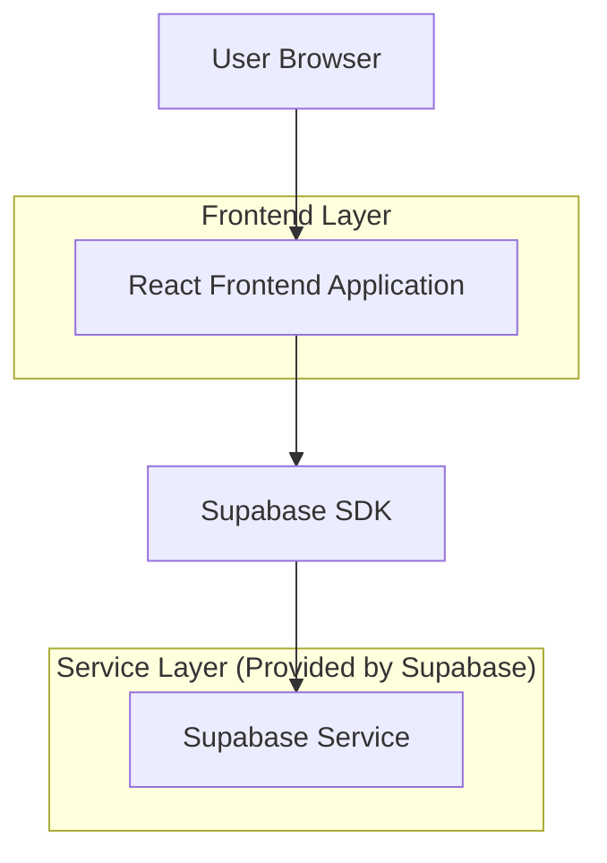
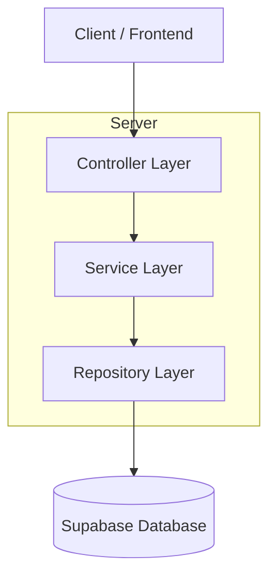
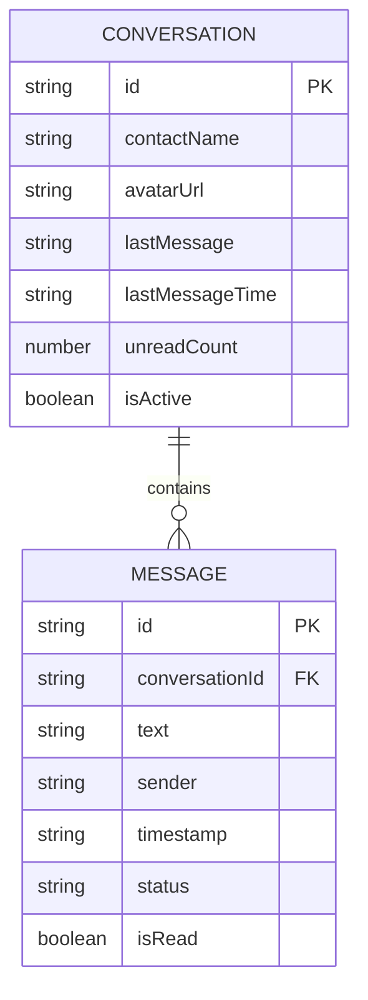

## 1. Architecture design



## 2. Technology Description
- Frontend: React@18 + tailwindcss@3 + vite
- Initialization Tool: vite-init
- Backend: Supabase
- CSS Framework: Tailwind CSS com classes customizadas para cores específicas
- Ícones: react-icons ou lucide-react
- Animações: framer-motion ou CSS transitions

## 3. Route definitions
| Route | Purpose |
|-------|---------|
| / | Interface principal com lista de conversas e painel de mensagens |
| /chat/:id | Visualização específica de uma conversa (opcional para mobile) |

## 4. API definitions

### 4.1 Core API

Gestão de conversas
```
GET /api/conversations
```

Response:
| Param Name| Param Type  | Description |
|-----------|-------------|-------------|
| id        | string      | ID único da conversa |
| name      | string      | Nome do contato |
| avatar    | string      | URL do avatar |
| lastMessage | string    | Preview da última mensagem |
| timestamp | string      | Horário da última mensagem |
| unreadCount | number    | Quantidade de mensagens não lidas |

Example
```json
{
  "conversations": [
    {
      "id": "conv_123",
      "name": "João Silva",
      "avatar": "/avatars/joao.jpg",
      "lastMessage": "Olá, tudo bem?",
      "timestamp": "14:30",
      "unreadCount": 2
    }
  ]
}
```

Gestão de mensagens
```
GET /api/messages/:conversationId
```

Response:
| Param Name| Param Type  | Description |
|-----------|-------------|-------------|
| id        | string      | ID único da mensagem |
| text      | string      | Conteúdo da mensagem |
| sender    | string      | Remetente (user/other) |
| timestamp | string      | Horário de envio |
| status    | string      | Status da mensagem |

## 5. Server architecture diagram


## 6. Data model

### 6.1 Data model definition


### 6.2 Data Definition Language
Conversations Table
```sql
-- create table
CREATE TABLE conversations (
    id UUID PRIMARY KEY DEFAULT gen_random_uuid(),
    contact_name VARCHAR(255) NOT NULL,
    avatar_url VARCHAR(500),
    last_message TEXT,
    last_message_time VARCHAR(10),
    unread_count INTEGER DEFAULT 0,
    is_active BOOLEAN DEFAULT true,
    created_at TIMESTAMP WITH TIME ZONE DEFAULT NOW()
);

-- create index
CREATE INDEX idx_conversations_active ON conversations(is_active);
CREATE INDEX idx_conversations_time ON conversations(last_message_time DESC);

-- grant permissions
GRANT SELECT ON conversations TO anon;
GRANT ALL PRIVILEGES ON conversations TO authenticated;
```

Messages Table
```sql
-- create table
CREATE TABLE messages (
    id UUID PRIMARY KEY DEFAULT gen_random_uuid(),
    conversation_id UUID REFERENCES conversations(id),
    text TEXT NOT NULL,
    sender VARCHAR(50) NOT NULL CHECK (sender IN ('user', 'other')),
    timestamp VARCHAR(10) NOT NULL,
    status VARCHAR(20) DEFAULT 'sent',
    is_read BOOLEAN DEFAULT false,
    created_at TIMESTAMP WITH TIME ZONE DEFAULT NOW()
);

-- create index
CREATE INDEX idx_messages_conversation ON messages(conversation_id);
CREATE INDEX idx_messages_timestamp ON messages(created_at DESC);

-- grant permissions
GRANT SELECT ON messages TO anon;
GRANT ALL PRIVILEGES ON messages TO authenticated;
```

-- init data
INSERT INTO conversations (contact_name, avatar_url, last_message, last_message_time, unread_count) VALUES
('João Silva', '/avatars/joao.jpg', 'Olá, tudo bem?', '14:30', 2),
('Maria Santos', '/avatars/maria.jpg', 'Até mais!', '13:45', 0),
('Pedro Oliveira', '/avatars/pedro.jpg', 'Obrigado!', '12:20', 1);

INSERT INTO messages (conversation_id, text, sender, timestamp, status) VALUES
((SELECT id FROM conversations WHERE contact_name = 'João Silva'), 'Olá, tudo bem?', 'other', '14:30', 'sent'),
((SELECT id FROM conversations WHERE contact_name = 'João Silva'), 'Oi! Tudo sim!', 'user', '14:31', 'read');